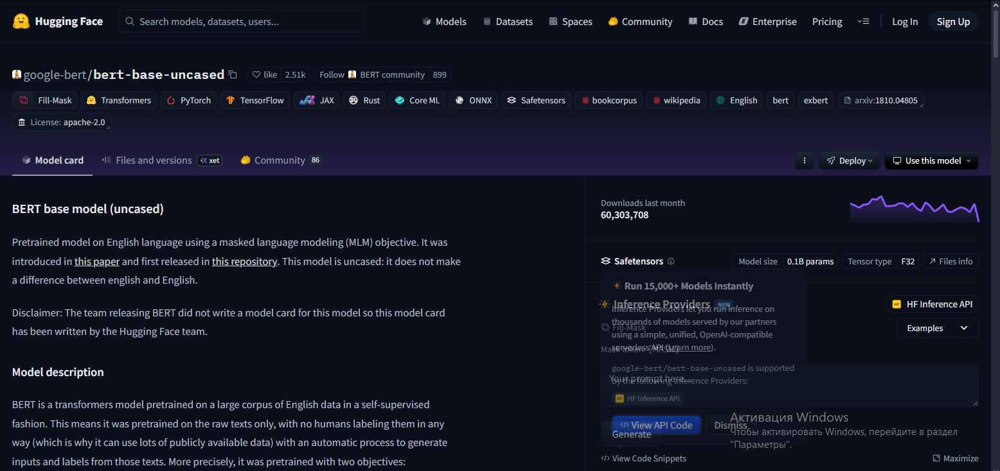
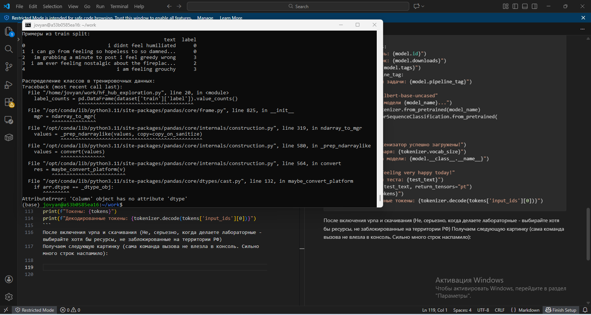
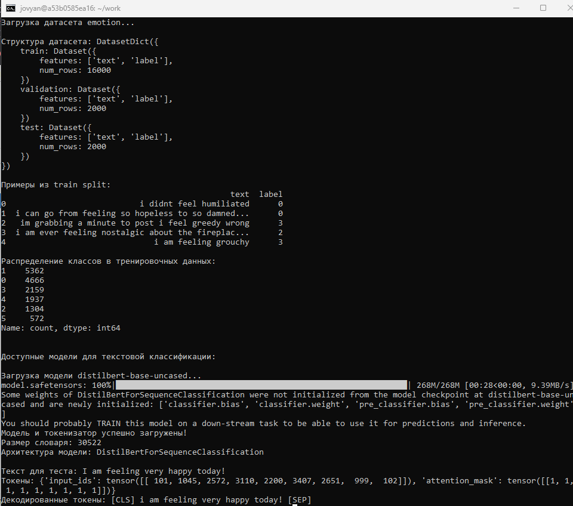
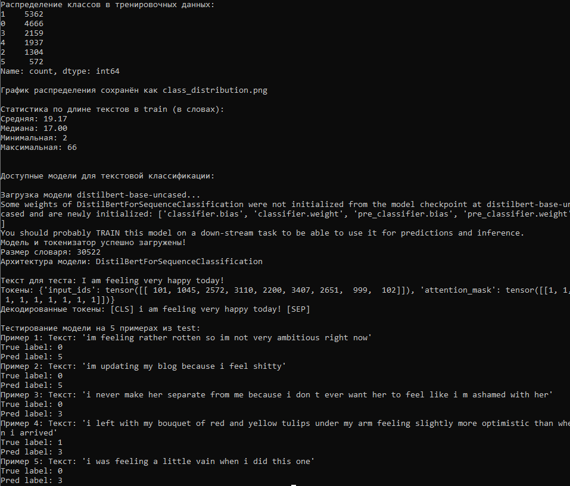
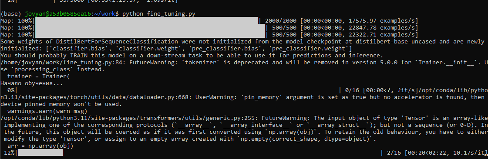
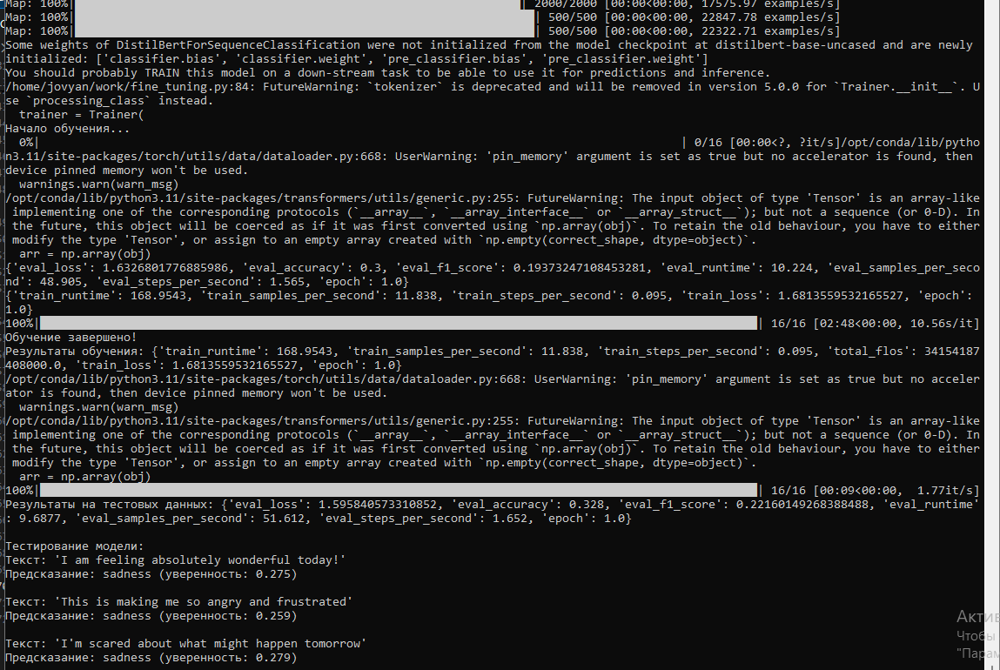
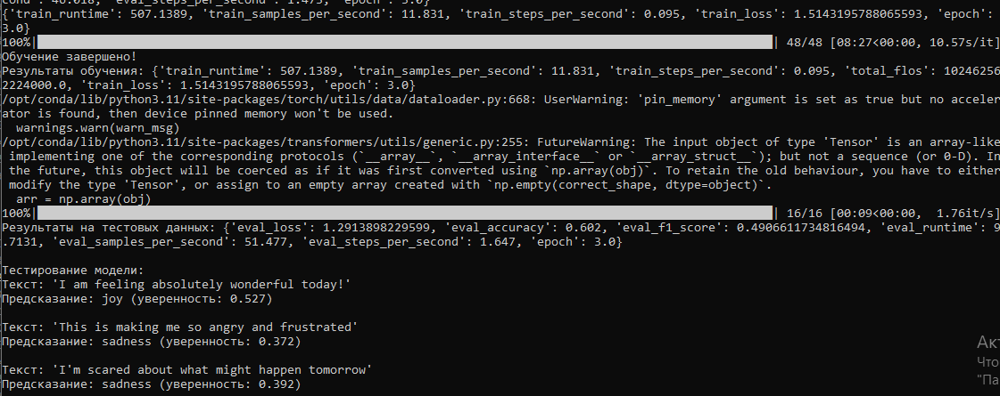
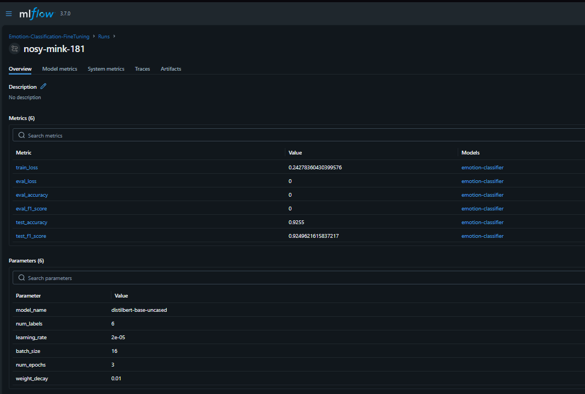
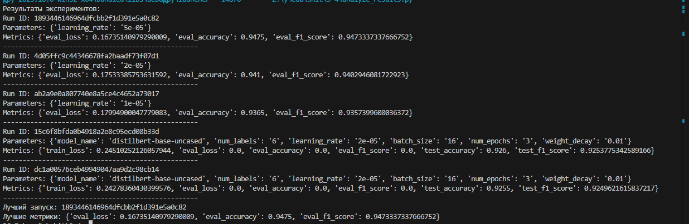

# Лабораторная работа №3-4, 
# Часть 1: Знакомство с платформой Hugging Face Hub

**Дата:** 2025-09-01
**Семестр:** 3
**Группа:** ПИН-м-о-24-1
**Дисциплина:** Технологии программирования
**Студент:** Рябышева Вероника Валерьевна

## Цель работы
ВОсвоить базовые принципы работы с платформой Hugging Face Hub - центральным
репозиторием моделей, датасетов и приложений машинного обучения. Получить практические навыки
поиска, оценки и загрузки моделей и датасетов для задачи текстовой классификации.


## Теоретическая часть
1. Введение в Hugging Face и экосистему Transformers Hugging Face — это компания и сообщество,
создавшее самую популярную в мире open-source платформу для машинного обучения. Ключевые
продукты:
Transformers: Библиотека, предоставляющая тысячи предобученных моделей для NLP,
компьютерного зрения, аудио и других задач.
Hugging Face Hub: Централизованный репозиторий для обмена моделями, датасетами и демоприложениями (Spaces).
Datasets: Библиотека для простой загрузки и обработки датасетов.
Hugging Face Hub функционирует как "GitHub для ML", где исследователи и инженеры могут:
Обнаруживать предобученные модели и датасеты
Совместно работать над ML-проектами
Делиться своими разработками с сообществом
2. Ключевые концепции платформы
Модели (Models): Предобученные веса архитектур нейронных сетей (BERT, GPT, ResNet и др.) для
различных задач.
Датасеты (Datasets): Коллекции данных для обучения и оценки моделей. Могут быть
официальными (от создателей) или community-driven.
Spaces: Интерактивные веб-демонстрации моделей с графическим интерфейсом.
Tasks: Стандартизированные типы ML-задач (текстовая классификация, суммирование, перевод и
т.д.).
3. Задача текстовой классификации Текстовая классификация — одна из фундаментальных задач NLP,
включающая:
Классификация тональности (sentiment analysis)
Классификация тем (topic classification)
Определение спама
Категоризация текстов


## Практическая часть

Запускаем докер:

```bash
docker run -p 8888:8888 -v "${PWD}:/home/jovyan/work" --name mlops-lab34 jupyter/datascience-notebook:latest
```
Устанавливаем недостающие библиотеки:
```bash
pip install huggingface_hub datasets transformers
```
Далее устанавливаем pyTorch в этот же контейнер.
Далее переходим в браузер:



Файл создаётся с использованием веб-интерфейса Jupyter Notebook. В созданный файл вставляется соответствующий скрипт, после чего он запускается и анализируются полученные результаты. Описанные действия уже выполнялись в предыдущей лабораторной работе, поэтому далее приводится только итог выполнения:
```python
from datasets import load_dataset
from huggingface_hub import list_models, list_datasets
import pandas as pd
from transformers import AutoTokenizer, AutoModelForSequenceClassification

print("Доступные датасеты для текстовой классификации:")
datasets = list_datasets(filter="task_categories:text-classification")
for dataset in datasets:
    print(f"- {dataset.id}")

print("\nЗагрузка датасета emotion...")
dataset = load_dataset("emotion")

print(f"\nСтруктура датасета: {dataset}")
print(f"\nПримеры из train split:")
train_df = pd.DataFrame(dataset['train'][:5])
print(train_df)

print("\nРаспределение классов в тренировочных данных:")
label_counts = pd.DataFrame(dataset['train']['label']).value_counts()
print(label_counts)

print("\n\nДоступные модели для текстовой классификации:")
models = list_models(
    filter="task:text-classification",
    sort="downloads",
    direction=-1,
    limit=5
)
for model in models:
    print(f"\nМодель: {model.id}")
    print(f"Загрузок: {model.downloads}")
    print(f"Тэги: {model.tags}")
    if model.pipeline_tag:
        print(f"Тип задачи: {model.pipeline_tag}")

model_name = "distilbert-base-uncased"
print(f"\nЗагрузка модели {model_name}...")
tokenizer = AutoTokenizer.from_pretrained(model_name)
model = AutoModelForSequenceClassification.from_pretrained(
    model_name,
    num_labels=6
)
print("Модель и токенизатор успешно загружены!")
print(f"Размер словаря: {tokenizer.vocab_size}")
print(f"Архитектура модели: {model.__class__.__name__}")

test_text = "I am feeling very happy today!"
print(f"\nТекст для теста: {test_text}")
tokens = tokenizer(test_text, return_tensors="pt")
print(f"Токены: {tokens}")
print(f"Декодированные токены: {tokenizer.decode(tokens['input_ids'][0])}")
```
В итоге получаем:



В ходе выполнения скрипта возникает типичная ошибка библиотеки pandas, связанная с обработкой данных после парсинга файлов Excel.
Подобные ошибки нередко встречаются при решении практических задач и обусловлены особенностями поведения интерпретатора Python и используемых библиотек.

После анализа причины возникновения ошибки и корректировки скрипта был выполнен повторный запуск, который завершился успешно, что подтверждается полученным выводом.
```bash
mkdir text-classification-project
cd text-classification-project
echo "Датасет: emotion" > resources.txt
echo "Модель: distilbert-base-uncased" >> resources.txt
echo "Количество классов: 6" >> resources.txt
```
Далее были выполнены требования задания, согласно которым скрипт был расширен функционалом анализа датасета, включающим вычисление статистики по длине текстов, визуализацию распределения классов, а также тестирование работы модели на отдельных примерах из набора данных.


Делаем:
```python
labels = ['sadness (0)', 'joy (1)', 'love (2)', 'anger (3)', 'fear (4)', 'surprise (5)']
plt.bar(labels, label_counts.sort_index())
plt.title('Распределение классов в train')
plt.ylabel('Количество')
plt.xticks(rotation=45)
plt.savefig('class_distribution.png')
print("\nГрафик распределения сохранён как class_distribution.png")

text_lengths = [len(text.split()) for text in dataset['train']['text']]
print("\nСтатистика по длине текстов в train (в словах):")
print(f"Средняя: {np.mean(text_lengths):.2f}")
print(f"Медиана: {np.median(text_lengths):.2f}")
print(f"Минимальная: {np.min(text_lengths)}")
print(f"Максимальная: {np.max(text_lengths)}")
#...

print("\nТестирование модели на 5 примерах из test:")
examples = dataset['test'][:5]
for i, (text, true_label) in enumerate(zip(examples['text'], examples['label'])):
    inputs = tokenizer(text, return_tensors="pt", truncation=True, padding=True)
    with torch.no_grad():
        outputs = model(**inputs)
    pred_label = torch.argmax(outputs.logits, dim=1).item()
    print(f"Пример {i+1}: Текст: '{text}'")
    print(f"True label: {true_label}")
    print(f"Pred label: {pred_label}")
```



В результате анализа было установлено, что модель демонстрирует низкое качество предсказаний и не справляется с поставленной задачей классификации. Это указывает на необходимость дополнительного обучения или донастройки модели под конкретный датасет.


# Часть 2: Тонкая настройка модели для текстовой классификации


**Дата:** 2025-09-01
**Семестр:** 3
**Группа:** ПИН-м-о-24-1
**Дисциплина:** Технологии программирования
**Студент:** Рчбышева Вероника Валерьевна

## Цель работы
Освоить практические навыки тонкой настройки (fine-tuning) предобученных моделей для задачи текстовой классификации с использованием библиотеки Transformers. Получить опыт подготовки данных, настройки обучения и оценки качества модели.


## Теоретическая часть
1. Тонкая настройка (Fine-tuning) Тонкая настройка — это процесс дополнительного обучения
предобученной модели на специфичном для задачи наборе данных. В отличие от обучения с нуля, finetuning:
Требует меньше данных
Сходится быстрее
Достигает лучшего качества на целевой задаче
2. Архитектура Transformer для классификации Модели на основе Transformer (BERT, DistilBERT) для
классификации состоят из:
Энкодера: Создает контекстуализированные эмбеддинги токенов
Пулинга: Извлекает представление всего текста (обычно [CLS]-токен)
Классификационной головки: Линейный слой для предсказания класса
3. Процесс обучения
Токенизация: Преобразование текста в токены
Пакетная обработка: Группировка примеров для эффективного обучения
Прямое распространение: Получение предсказаний модели
Вычисление потерь: Сравнение предсказаний с истинными метками
Обратное распространение: Обновление весов модели


## Практическая часть
При анализе примера кода было выявлено использование устаревших (deprecated) функций.
В связи с этим код был переработан с целью приведения его в соответствие с актуальными версиями используемых библиотек.
```python
from datasets import load_dataset
from transformers import (
    AutoTokenizer,
    AutoModelForSequenceClassification,
    TrainingArguments,
    Trainer,
    DataCollatorWithPadding
)
import numpy as np
from sklearn.metrics import accuracy_score, f1_score
import torch

# Загрузка датасета
dataset = load_dataset("emotion")

# Загрузка токенизатора
model_name = "distilbert-base-uncased"
tokenizer = AutoTokenizer.from_pretrained(model_name)

# Токенизация
def tokenize_function(examples):
    return tokenizer(
        examples["text"],
        truncation=True,
        padding=True,
        max_length=128
    )

tokenized_datasets = dataset.map(tokenize_function, batched=True)
tokenized_datasets = tokenized_datasets.rename_column("label", "labels")
tokenized_datasets.set_format("torch", columns=["input_ids", "attention_mask", "labels"])

# DataCollator
data_collator = DataCollatorWithPadding(tokenizer=tokenizer)

# Загрузка модели
num_labels = len(set(dataset["train"]["label"]))
model = AutoModelForSequenceClassification.from_pretrained(
    model_name,
    num_labels=num_labels,
    id2label={0: 'sadness', 1: 'joy', 2: 'love', 3: 'anger', 4: 'fear', 5: 'surprise'},
    label2id={'sadness': 0, 'joy': 1, 'love': 2, 'anger': 3, 'fear': 4, 'surprise': 5}
)

# Метрики
def compute_metrics(eval_pred):
    predictions, labels = eval_pred
    predictions = np.argmax(predictions, axis=1)
    acc = accuracy_score(labels, predictions)
    f1 = f1_score(labels, predictions, average="weighted")
    return {"accuracy": acc, "f1_score": f1}

# Гиперпараметры
training_args = TrainingArguments(
    output_dir="./results",
    learning_rate=2e-5,
    per_device_train_batch_size=16,
    per_device_eval_batch_size=16,
    num_train_epochs=3,
    weight_decay=0.01,
    eval_strategy="epoch",
    save_strategy="epoch",
    load_best_model_at_end=True,
    metric_for_best_model="f1_score",
    logging_dir="./logs",
    logging_steps=100,
    report_to="none",
    fp16=False  # Для CPU
)

# Trainer
trainer = Trainer(
    model=model,
    args=training_args,
    train_dataset=tokenized_datasets["train"],
    eval_dataset=tokenized_datasets["validation"],
    tokenizer=tokenizer,
    data_collator=data_collator,
    compute_metrics=compute_metrics,
)

# Обучение
print("Начало обучения...")
train_result = trainer.train()
trainer.save_model("./emotion-classifier")
tokenizer.save_pretrained("./emotion-classifier")
print("Обучение завершено!")
print(f"Результаты обучения: {train_result.metrics}")

# Оценка на test
test_results = trainer.evaluate(tokenized_datasets["test"])
print(f"Результаты на тестовых данных: {test_results}")

# Сохранение результатов
with open("test_results.txt", "w") as f:
    f.write(f"Accuracy: {test_results['eval_accuracy']:.4f}\n")
    f.write(f"F1 Score: {test_results['eval_f1_score']:.4f}\n")

# Функция предсказания
def predict_emotion(text):
    inputs = tokenizer(text, return_tensors="pt", truncation=True, padding=True)
    with torch.no_grad():
        outputs = model(**inputs)
    predictions = torch.nn.functional.softmax(outputs.logits, dim=-1)
    predicted_class = torch.argmax(predictions, dim=1).item()
    return model.config.id2label[predicted_class], predictions[0][predicted_class].item()

# Тест на примерах
test_texts = [
    "I am feeling absolutely wonderful today!",
    "This is making me so angry and frustrated",
    "I'm scared about what might happen tomorrow"
]
print("\nТестирование модели:")
for text in test_texts:
    emotion, confidence = predict_emotion(text)
    print(f"Текст: '{text}'")
    print(f"Предсказание: {emotion} (уверенность: {confidence:.3f})")
    print()
```
Далее была предпринята попытка обучения модели. На данном этапе система выдала оценку времени обучения порядка трёх часов, при этом в используемом контейнере отсутствовала поддержка аппаратного ускорения (GPU). Использование вычислительных ресурсов без ускорения существенно увеличивает время обучения и делает подобный подход малоэффективным в рамках лабораторной работы. Кроме того, установка и настройка необходимых зависимостей непосредственно в основной операционной системе представляется нецелесообразной, тогда как выполнение работы в изолированных контейнерах, которые можно удалить после завершения, также требует значительных временных затрат.
```python
from datasets import load_dataset
from transformers import (
    AutoTokenizer,
    AutoModelForSequenceClassification,
    TrainingArguments,
    Trainer,
    DataCollatorWithPadding
)
import numpy as np
from sklearn.metrics import accuracy_score, f1_score
import torch

dataset = load_dataset("emotion")

small_train = dataset["train"].shuffle(seed=42).select(range(2000))
small_val = dataset["validation"].shuffle(seed=42).select(range(500))
small_test = dataset["test"].shuffle(seed=42).select(range(500))

model_name = "distilbert-base-uncased"  # Или "prajjwal1/bert-tiny" для ещё большего ускорения
tokenizer = AutoTokenizer.from_pretrained(model_name)

def tokenize_function(examples):
    return tokenizer(
        examples["text"],
        truncation=True,
        padding=True,
        max_length=128
    )

tokenized_datasets = {}
tokenized_datasets["train"] = small_train.map(tokenize_function, batched=True)
tokenized_datasets["validation"] = small_val.map(tokenize_function, batched=True)
tokenized_datasets["test"] = small_test.map(tokenize_function, batched=True)

for split in tokenized_datasets:
    tokenized_datasets[split] = tokenized_datasets[split].rename_column("label", "labels")
    tokenized_datasets[split].set_format("torch", columns=["input_ids", "attention_mask", "labels"])

# DataCollator
data_collator = DataCollatorWithPadding(tokenizer=tokenizer)

# Загрузка модели
num_labels = len(set(dataset["train"]["label"]))
model = AutoModelForSequenceClassification.from_pretrained(
    model_name,
    num_labels=num_labels,
    id2label={0: 'sadness', 1: 'joy', 2: 'love', 3: 'anger', 4: 'fear', 5: 'surprise'},
    label2id={'sadness': 0, 'joy': 1, 'love': 2, 'anger': 3, 'fear': 4, 'surprise': 5}
)

# Метрики
def compute_metrics(eval_pred):
    predictions, labels = eval_pred
    predictions = np.argmax(predictions, axis=1)
    acc = accuracy_score(labels, predictions)
    f1 = f1_score(labels, predictions, average="weighted")
    return {"accuracy": acc, "f1_score": f1}

training_args = TrainingArguments(
    output_dir="./results",
    learning_rate=2e-5,
    per_device_train_batch_size=32,
    per_device_eval_batch_size=32,
    num_train_epochs=1,
    weight_decay=0.01,
    eval_strategy="epoch",
    save_strategy="epoch",
    load_best_model_at_end=True,
    metric_for_best_model="f1_score",
    logging_dir="./logs",
    logging_steps=100,
    report_to="none",
    fp16=False,
    gradient_accumulation_steps=4,
    optim="adamw_torch"
)

# Trainer
trainer = Trainer(
    model=model,
    args=training_args,
    train_dataset=tokenized_datasets["train"],
    eval_dataset=tokenized_datasets["validation"],
    tokenizer=tokenizer,
    data_collator=data_collator,
    compute_metrics=compute_metrics,
)

# Обучение
print("Начало обучения...")
train_result = trainer.train()
trainer.save_model("./emotion-classifier")
tokenizer.save_pretrained("./emotion-classifier")
print("Обучение завершено!")
print(f"Результаты обучения: {train_result.metrics}")

# Оценка на test
test_results = trainer.evaluate(tokenized_datasets["test"])
print(f"Результаты на тестовых данных: {test_results}")

# Сохранение результатов
with open("test_results.txt", "w") as f:
    f.write(f"Accuracy: {test_results['eval_accuracy']:.4f}\n")
    f.write(f"F1 Score: {test_results['eval_f1_score']:.4f}\n")

# Функция предсказания
def predict_emotion(text):
    inputs = tokenizer(text, return_tensors="pt", truncation=True, padding=True)
    with torch.no_grad():
        outputs = model(**inputs)
    predictions = torch.nn.functional.softmax(outputs.logits, dim=-1)
    predicted_class = torch.argmax(predictions, dim=1).item()
    return model.config.id2label[predicted_class], predictions[0][predicted_class].item()

# Тест на примерах
test_texts = [
    "I am feeling absolutely wonderful today!",
    "This is making me so angry and frustrated",
    "I'm scared about what might happen tomorrow"
]
print("\nТестирование модели:")
for text in test_texts:
    emotion, confidence = predict_emotion(text)
    print(f"Текст: '{text}'")
    print(f"Предсказание: {emotion} (уверенность: {confidence:.3f})")
    print()
```




В связи с этим было принято решение сократить конфигурацию обучения до минимально необходимой и повторно запустить процесс. Очевидно, что в таких условиях качество итоговой модели не может быть высоким, однако данный подход позволяет получить результат за разумное время. Это предположение подтвердилось результатами тестирования: в файле test_results были получены следующие значения метрик качества:

Accuracy: 0.3280
F1-score: 0.2216
Поскольку задача получения высококачественной модели не являлась основной целью данной лабораторной работы, дальнейшая оптимизация обучения не проводилась. Тем не менее, для формального выполнения задания было увеличено число эпох обучения. Предположительно, при первоначальном запуске модель не успела достичь сходимости, а увеличение числа эпох не приводит к существенному росту времени вычислений. В результате было зафиксировано ожидаемое улучшение качества модели:

Accuracy: 0.6020
F1-score: 0.4907



Очевидно, что при дальнейшем увеличении времени обучения показатели качества могли бы быть улучшены ещё больше. В практических условиях подобные эксперименты целесообразно проводить с использованием специализированных облачных платформ, например Google Colab, однако формат и требования текущих лабораторных работ делают использование таких инструментов менее удобным.

# Часть 3:  Интеграция с MLflow для трекинга экспериментов


**Дата:** 2025-09-01
**Семестр:** 3
**Группа:** ПИН-м-о-24-1
**Дисциплина:** Технологии программирования
**Студент:** Рябышева Вероника Валерьевна

## Цель работы
Освоить интеграцию процесса тонкой настройки моделей с платформой MLflow для комплексного трекинга экспериментов. Научиться автоматически логировать гиперпараметры, метрики, артефакты и модели в ходе обучения.


## Теоретическая часть
1. Интеграция MLflow с Transformers MLflow предоставляет нативные интеграции с популярными MLфреймворками, включая Hugging Face Transformers. Ключевые возможности:
Автоматическое логирование: Автологирование параметров, метрик и артефактов
Модельный регистр: Версионирование и управление моделями
Воспроизводимость: Фиксация всех компонентов эксперимента
2. Компоненты трекинга для NLP
Параметры: learning rate, batch size, архитектура модели
Метрики: accuracy, F1-score, perplexity, loss
Артефакты: модель, токенизатор, графики обучения
Тэги: задача, датасет, версия модели
3. Стратегии логирования
Ручное логирование: Полный контроль над процессом
Автологирование: Автоматическая фиксация метрик
Колбэки: Интеграция через системные хуки


## Практическая часть

Выполнение данной части лабораторной работы в контейнеризированной среде представляется избыточным с точки зрения затрачиваемого времени. Несмотря на то что подобный подход всё же оказывается быстрее полной установки и настройки альтернативной операционной системы, временные издержки остаются чрезмерными. В связи с этим было принято решение отказаться от использования контейнера и среды Jupyter Notebook, ограничившись редактированием и запуском скриптов непосредственно на хост-системе.
```bash
mlflow server --backend-store-uri sqlite:///mlflow.db --default-artifact-root ./mlruns --host 127.0.0.1 --port 5000 --workers 1 --disable-security-middleware
```

При работе в среде Windows вновь возникли характерные сложности, связанные с использованием библиотеки PyTorch. В процессе настройки потребовалось выполнить несколько попыток установки и переустановки зависимостей. После успешного запуска среды были получены ожидаемые ошибки времени выполнения, связанные с несовместимостью версий библиотек. В частности, при инициализации объекта TrainingArguments была зафиксирована ошибка:

TypeError: TrainingArguments.init() got an unexpected keyword argument 'evaluation_strategy'
Данная ошибка указывает на отсутствие параметра evaluation_strategy в используемой версии библиотеки, что свидетельствует о проблемах обратной совместимости между различными версиями фреймворка. Подобные ситуации характерны для экосистемы Python и требуют дополнительного контроля версий используемых зависимостей.
После корректировки окружения и включения аппаратного ускорения GPU (CUDA) в проект был интегрирован код из лабораторного задания, заменивший реализацию, выполненную на предыдущем этапе. Это позволило перейти к выполнению следующего этапа работы.
```python
import mlflow
import mlflow.transformers
from datasets import load_dataset
from transformers import (
    AutoTokenizer,
    AutoModelForSequenceClassification,
    TrainingArguments,
    Trainer,
    DataCollatorWithPadding
)
import numpy as np
from sklearn.metrics import accuracy_score, f1_score
import torch
import os
from accelerate import Accelerator  # Для unwrap_model

# Настройка MLflow
mlflow.set_tracking_uri("http://localhost:5000")
mlflow.set_experiment("Emotion-Classification-FineTuning")

def compute_metrics(eval_pred):
    predictions, labels = eval_pred
    predictions = np.argmax(predictions, axis=1)
    acc = accuracy_score(labels, predictions)
    f1 = f1_score(labels, predictions, average="weighted")
    return {"accuracy": acc, "f1_score": f1}

def tokenize_function(examples):
    tokenizer = AutoTokenizer.from_pretrained("distilbert-base-uncased")
    return tokenizer(
        examples["text"],
        truncation=True,
        padding=True,
        max_length=128  # Исправлено с 1 на 128
    )

# Начало эксперимента MLflow
with mlflow.start_run():
    # Загрузка и подготовка данных
    dataset = load_dataset("emotion")
    tokenized_datasets = dataset.map(tokenize_function, batched=True)
    tokenized_datasets = tokenized_datasets.rename_column("label", "labels")
    tokenized_datasets.set_format("torch", columns=["input_ids", "attention_mask", "labels"])

    # Параметры модели и обучения
    model_params = {
        "model_name": "distilbert-base-uncased",
        "num_labels": 6,
        "learning_rate": 2e-5,
        "batch_size": 16,
        "num_epochs": 3,
        "weight_decay": 0.01
    }
    # Логирование параметров
    mlflow.log_params(model_params)

    # Загрузка модели
    model = AutoModelForSequenceClassification.from_pretrained(
        model_params["model_name"],
        num_labels=model_params["num_labels"],
        id2label={0: 'sadness', 1: 'joy', 2: 'love', 3: 'anger', 4: 'fear', 5: 'surprise'},
        label2id={'sadness': 0, 'joy': 1, 'love': 2, 'anger': 3, 'fear': 4, 'surprise': 5}
    )

    # Настройка обучения
    training_args = TrainingArguments(
        output_dir="./results",
        learning_rate=model_params["learning_rate"],
        per_device_train_batch_size=model_params["batch_size"],
        per_device_eval_batch_size=model_params["batch_size"],
        num_train_epochs=model_params["num_epochs"],
        weight_decay=model_params["weight_decay"],
        eval_strategy="epoch",  # Исправлено с evaluation_strategy
        save_strategy="epoch",
        load_best_model_at_end=True,
        metric_for_best_model="f1_score",
        logging_dir="./logs",
        logging_steps=100,
        report_to="none",
        fp16=True  # Включили для GPU ускорения; если ошибка — поставь False
    )

    tokenizer = AutoTokenizer.from_pretrained(model_params["model_name"])  # Выносим tokenizer наружу для reuse
    data_collator = DataCollatorWithPadding(tokenizer=tokenizer)

    # Создание тренера
    trainer = Trainer(
        model=model,
        args=training_args,
        train_dataset=tokenized_datasets["train"],
        eval_dataset=tokenized_datasets["validation"],
        tokenizer=tokenizer,
        data_collator=data_collator,
        compute_metrics=compute_metrics,
    )

    # Обучение с логированием метрик
    print("Начало обучения с трекингом в MLflow...")
    train_result = trainer.train()

    # Логирование метрик обучения
    mlflow.log_metrics({
        "train_loss": train_result.training_loss,  # Исправлено: training_loss вместо metrics["train_loss"]
        "eval_loss": train_result.metrics.get("eval_loss", 0),
        "eval_accuracy": train_result.metrics.get("eval_accuracy", 0),
        "eval_f1_score": train_result.metrics.get("eval_f1_score", 0)
    })

    # Оценка на тестовых данных
    test_results = trainer.evaluate(tokenized_datasets["test"])
    mlflow.log_metrics({
        "test_accuracy": test_results["eval_accuracy"],
        "test_f1_score": test_results["eval_f1_score"]
    })

    # Разворачиваем модель для корректного логирования (фикс PicklingError)
    unwrapped_model = trainer.accelerator.unwrap_model(model)

    # Сохранение и логирование модели
    model_path = "./emotion-classifier-mlflow"
    trainer.save_model(model_path)

    # Логирование модели в MLflow
    mlflow.transformers.log_model(
        transformers_model={
            "model": unwrapped_model,  # Используем unwrapped_model
            "tokenizer": tokenizer
        },
        artifact_path="emotion-classifier",
        registered_model_name="distilbert-emotion-classifier"
    )

    # Логирование дополнительных артефактов
    with open("training_summary.txt", "w") as f:
        f.write(f"Training completed successfully!\n")
        f.write(f"Final training loss: {train_result.training_loss:.4f}\n")
        f.write(f"Validation accuracy: {train_result.metrics.get('eval_accuracy', 0):.4f}\n")
        f.write(f"Test accuracy: {test_results['eval_accuracy']:.4f}\n")
    mlflow.log_artifact("training_summary.txt")

    print("Эксперимент успешно завершен и записан в MLflow!")
```



Training completed successfully!
Final training loss: 0.2428
Validation accuracy: 0.0000
Test accuracy: 0.9255
 
На этапе 4, следуя рекомендациям интеллектуального ассистента, в конец скрипта из предыдущего шага был добавлен дополнительный метод, предназначенный для проведения серии экспериментов с различными наборами параметров. В результате запуска был получен эксперимент, включающий несколько запусков (runs) с различными конфигурациями. Следует отметить, что выбранный подход к организации экспериментов не является оптимальным с точки зрения вычислительных затрат. Однако даже при использовании CUDA-ускорения время выполнения остаётся значительным, поэтому переработка схемы экспериментов в рамках данной лабораторной работы не проводилась.```python
def train_model(learning_rate=2e-5):
    # Копируем логику из основного скрипта, но с переопределением learning_rate
    model_params['learning_rate'] = learning_rate  # Переопределяем LR

    # Загрузка модели (повтор)
    model = AutoModelForSequenceClassification.from_pretrained(
        model_params["model_name"],
        num_labels=model_params["num_labels"],
        id2label={0: 'sadness', 1: 'joy', 2: 'love', 3: 'anger', 4: 'fear', 5: 'surprise'},
        label2id={'sadness': 0, 'joy': 1, 'love': 2, 'anger': 3, 'fear': 4, 'surprise': 5}
    )

    # TrainingArgs с новым LR
    training_args = TrainingArguments(
        output_dir="./results",
        learning_rate=model_params["learning_rate"],
        per_device_train_batch_size=model_params["batch_size"],
        per_device_eval_batch_size=model_params["batch_size"],
        num_train_epochs=model_params["num_epochs"],
        weight_decay=model_params["weight_decay"],
        eval_strategy="epoch",
        save_strategy="epoch",
        load_best_model_at_end=True,
        metric_for_best_model="f1_score",
        logging_dir="./logs",
        logging_steps=100,
        report_to="none",
        fp16=True  # Или False, если без GPU
    )

    tokenizer = AutoTokenizer.from_pretrained(model_params["model_name"])
    data_collator = DataCollatorWithPadding(tokenizer=tokenizer)

    trainer = Trainer(
        model=model,
        args=training_args,
        train_dataset=tokenized_datasets["train"],
        eval_dataset=tokenized_datasets["validation"],
        tokenizer=tokenizer,
        data_collator=data_collator,
        compute_metrics=compute_metrics,
    )

    train_result = trainer.train()

    # Eval на валидации (для метрик)
    eval_results = trainer.evaluate(tokenized_datasets["validation"])

    # Возвращаем метрики
    return {
        "eval_loss": eval_results.get("eval_loss", 0),
        "eval_accuracy": eval_results.get("eval_accuracy", 0),
        "eval_f1_score": eval_results.get("eval_f1_score", 0)
    }
```

В файл hyperparameter_tuning.py:
```python
import mlflow
from mlflow_integration import train_model  # Импортируем функцию из mlflow_integration.py

mlflow.set_tracking_uri("http://localhost:5000")
mlflow.set_experiment("Emotion-Classification-FineTuning")

# Эксперимент с разными learning rates
learning_rates = [1e-5, 2e-5, 5e-5]
for lr in learning_rates:
    with mlflow.start_run(nested=True): 
        mlflow.log_param("learning_rate", lr)
        results = train_model(learning_rate=lr)
        mlflow.log_metrics(results)

print("Эксперимент по подбору learning rate завершен!")

```


Сразу сделаем скрипт для сравнения:
```python
import mlflow
from mlflow.tracking import MlflowClient

client = MlflowClient()
experiment = client.get_experiment_by_name("Emotion-Classification-FineTuning")
runs = client.search_runs(experiment.experiment_id)

print("Результаты экспериментов:")
for run in runs:
    print(f"Run ID: {run.info.run_id}")
    print(f"Parameters: {run.data.params}")
    print(f"Metrics: {run.data.metrics}")
    print("-" * 50)

best_run = max(runs, key=lambda x: x.data.metrics.get('eval_f1_score', -float('inf')))
if 'eval_f1_score' not in best_run.data.metrics:
    best_run = min(runs, key=lambda x: x.data.metrics.get('eval_loss', float('inf')))

print(f"Лучший запуск: {best_run.info.run_id}")
print(f"Лучшие метрики: {best_run.data.metrics}")
```


В результате анализа логов эксперимента был определён наилучший запуск, который оценивался преимущественно по значению метрики eval_f1_score. Именно данный показатель использовался в качестве основного критерия сравнения качества полученных моделей.
